# v1.0 
## 1. 第七阶段课程大纲：
 ```
1. Nginx:HTTP服务器，反向代理服务器
2. Spring Session :互联网应用中集群/分布式模式下的Session共享解决方案：
3. Spring Boot :Spring家族中的一个全新微服务开发框架：
4. FastDFS:分布式文件系统，大容量文件存储解决方案；
5. AdtiveMQ:消息队列服务器，消息中间件；
6. MYSQL:主从复制，一主多从，双主双从，多数据源；
7. SecKill :开发一个高并发秒杀项目（综合实战）
8. Mycat:Mysql数据库中间件，实现读写分离与分库分表；
9. HighCurrency:互联网中常见大流量高并发解决方案：（面试常问）
10. P2P-Admin:开发一个P2P后台管理系统（开发几个核心功能）
```

## 2. Spring boot简介：
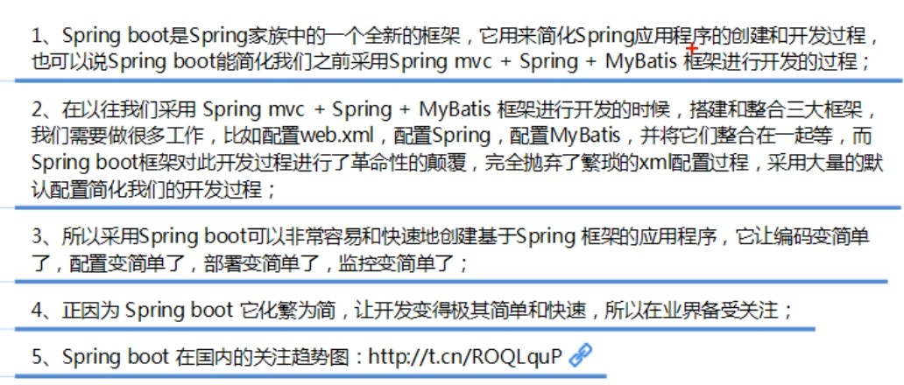

## 3. Spring boot特性:
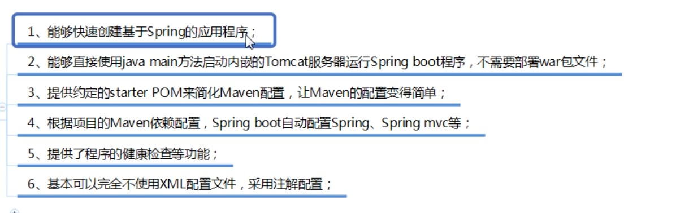

## 4. Spring boot四大核心：
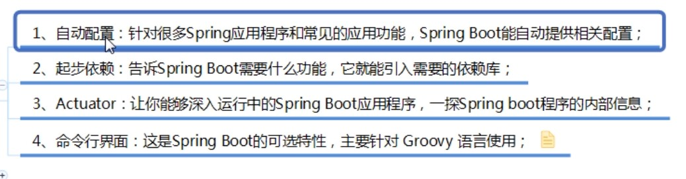

***Groovy:***
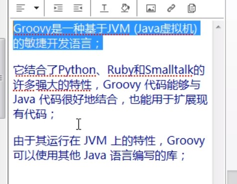


## 5. Spring boot开发环境：
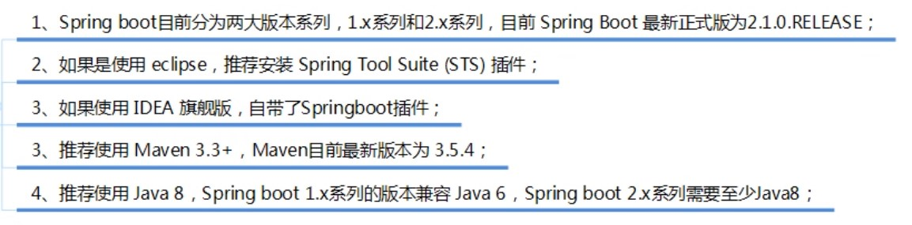

## 6. 第一个Spring boot程序：
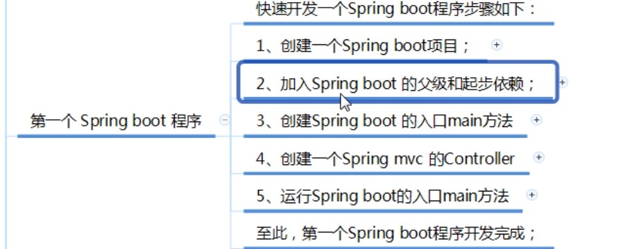

### 第一步：创建一个Spring boot项目：
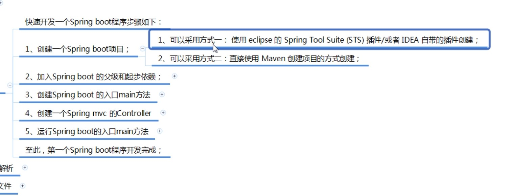
***打包方式：springboot程序默认是打jar包***


### 第二步：加入Spring boot的父级和起步依赖：
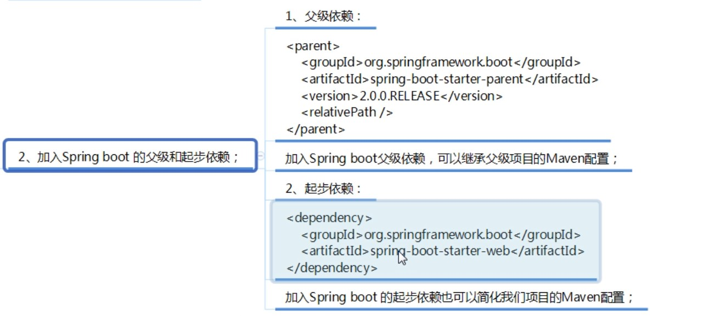

### 第三步：创建Spring boot的入口main方法：
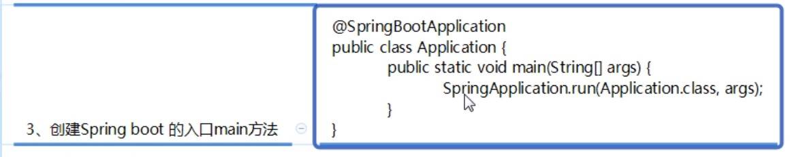


### 第四步：创建Spring mvc的Controller：
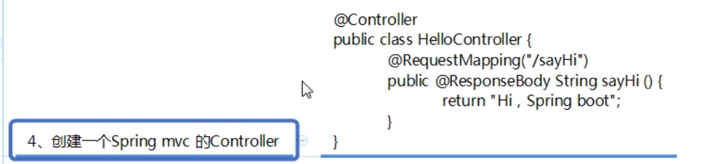

### 第五步：运行Spring boot的入口main方法：


## spirng boot 程序分析：
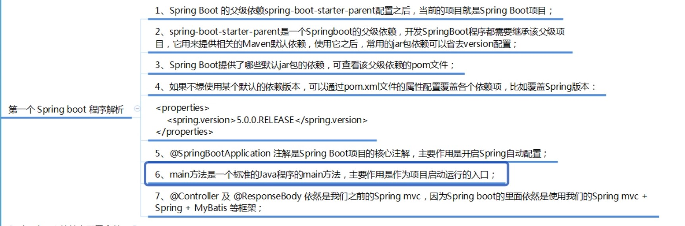


## spirng boot 的核心配置文件：


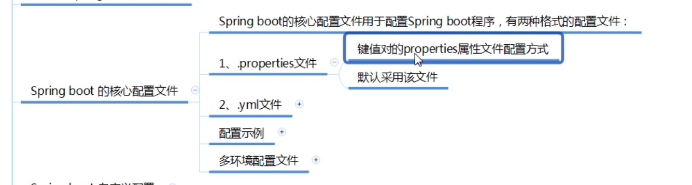

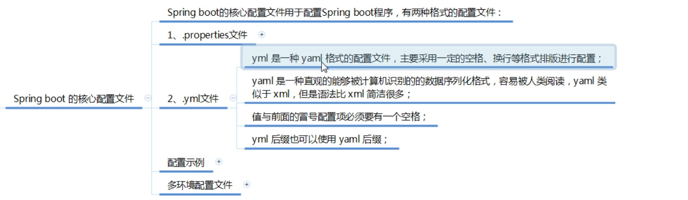

***默认是读application.properties，当application.properties和application.yml都存在的时候也是默认读application.properties文件中的配置。所以要想读yml文件，需要将application.properties文件删除或者改名***


# v2.0
## 多环境配置文件（主要用于 你有多套环境的时候）：
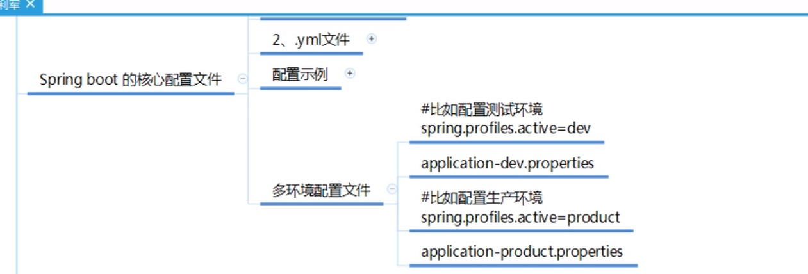

## Spring Boot 自定义配置：
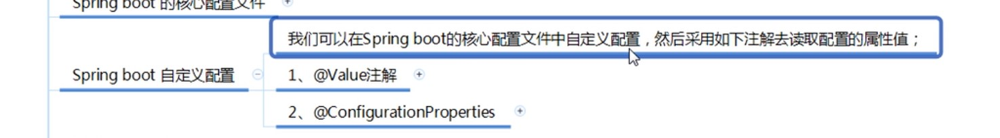
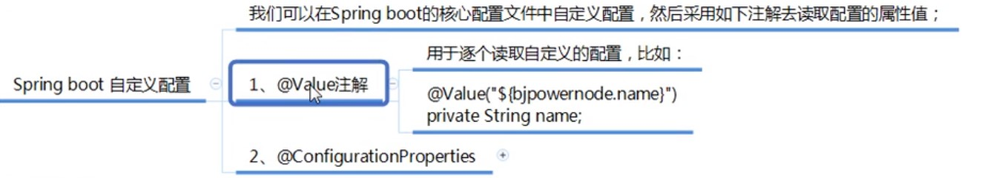
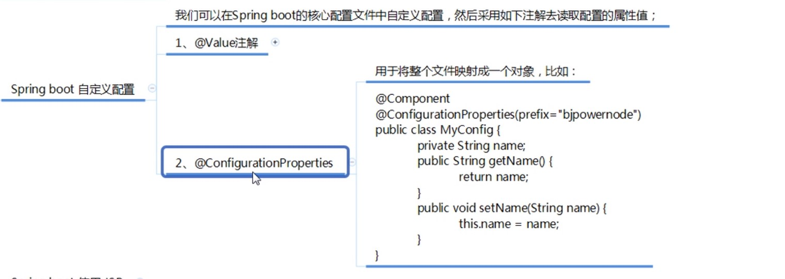
***这个方式，使用于配置项比较多的时候***


# v3.0 Spring Boot使用JSP：
***步骤：***

1. 在pom.xml文件中配置依赖项：

```java
<dependency>
            <groupId>org.apache.tomcat.embed</groupId>
            <artifactId>tomcat-embed-jasper</artifactId>
        </dependency>
```

除了上面这个包之外，还有下面这几个包，但是这几个包是可选的（因为运行时候，servlet,jsp啊，这些tomcat中都有，所以你可以加也可以不加）：
```java
<!--        servlet依赖的jar包-->
        <dependency>
            <groupId>javax.servlet</groupId>
            <artifactId>javax.servlet-api</artifactId>
        </dependency>
        <!--        jsp依赖的jar包-->
        <dependency>
            <groupId>javax.servlet.jsp</groupId>
            <artifactId>javax.servlet.jsp-api</artifactId>
            <version>2.3.1</version>
        </dependency>

        <!--        jstl标签依赖的jar包-->
        <dependency>
            <groupId>javax.servlet</groupId>
            <artifactId>jstl</artifactId>
        </dependency>

```


2. 在application.properties配置文件中，配置spring mvc的视图展示位jsp:
```java
spring.mvc.view.prefix=/
spring.mvc.view.suffix=.jsp
```

3. 在src/main下创建一个webapp目录，然后在该目录下新建jsp页面
4. 要在pom.xml中的build种，要配置备注中的配置信息：
```java
 <resources>
            <resource>
                <directory>src/main/java</directory>
                <includes>
                    <include>**/*.xml</include>
                </includes>
            </resource>
            <resource>
                <directory>src/main/resources</directory>
                <includes>
                    <include>**/*.*</include>
                </includes>
            </resource>
            <!--  打包时将jsp文件拷贝到META-INF目录下 -->
            <resource>
                <!-- 源文件位置 -->
                <directory>src/main/webapp</directory>
                <!--编译到META-INF/resources目录下 -->
                <targetPath>META-INF/resources</targetPath>
                <includes>
<!--                    要把哪些文件编译过去，**表示多层目录，*.*表示所有文件-->
                    <include>**/*.*</include>
                </includes>
            </resource>
        </resources>
```

5. 新建jspConrtoller写代码测试一下。

# v4.0springBoot整合mybatis:

***步骤：***

1. 在pom.xml中配置相关jar依赖：
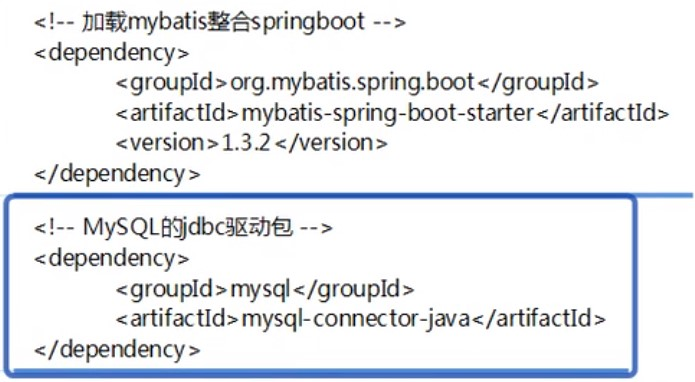


2. 在springboot的核心配置文件application.properties中配置数据源：
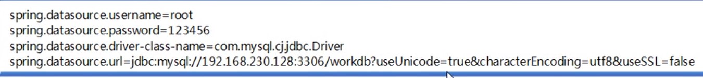

3. 在MyBatis的Mapper接口中添加@Mapper注解；
或者在运动的主类上添加 @MapperScan("com.bjpowernode.springboot.mapper")注解包扫描

4.在pom.xml中配置[myBatis代码自动生成]插件：
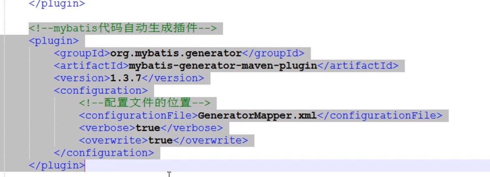

等maven下载号之后，双击对应的插件：
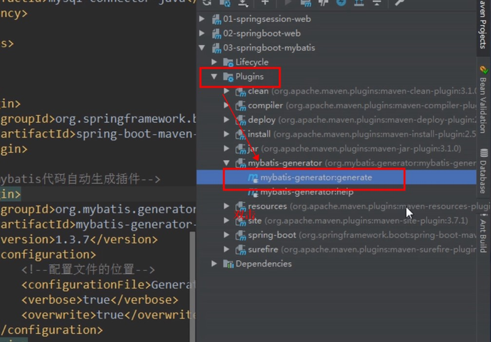


没写完，写不下去了，看视频


# v5.0 Spring Boot下的Spring MVC:

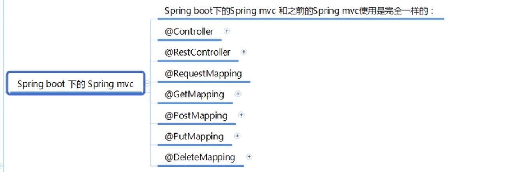

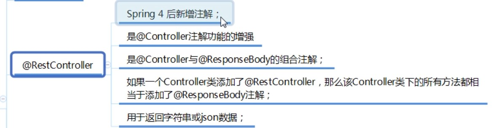


# v6.0 Spring Boot下的Restfull:

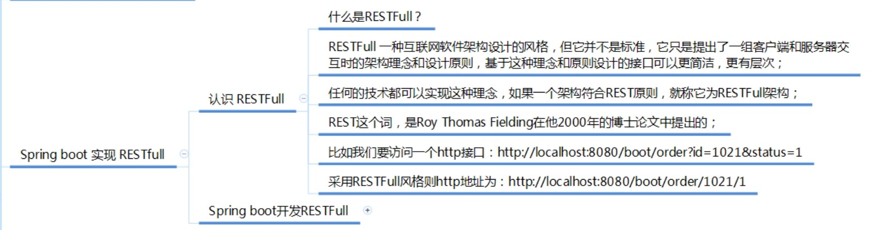
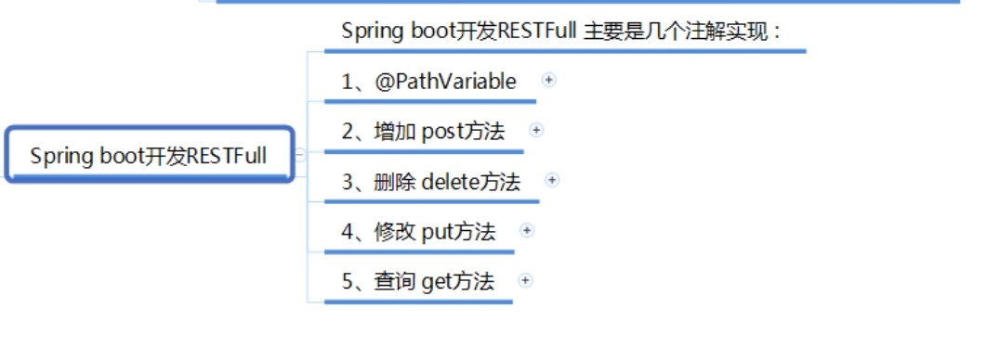


```java
Restfull原则：
1. 增post请求，删delete请求，改put请求，查get请求
2. 请求路径不要出现动词，查询订单：/boot/order/1/1021(正确), /boot/queryOrder/1/1021 (query是动词，不建议使用)
3. 分页，排序等操作，不需要采用斜杆传参数：比如说订单列表接口： /boot/orders?p=1&sort=desc
    所以：当传的参数不是数据库里的字段的时候，可以不用斜杆，可以用？的形式。
```

# v6.0 Spring Boot集成redis:
# v7.0 Spring Boot集成Dubbo:
# v8.0 Spring Boot热部署插件:
> 在实际开发中，我们修改某些代码逻辑功能或页面都需要重启应用，这无形中降低了开发效率；
> 热部署是指我们修改代码后，服务能自动重启加载新修改的内容，这样大大提高了我们的改法效率；
> spring boot热部署通过添加一个插件实现：<font color="red">spring-boot-devtools</font>
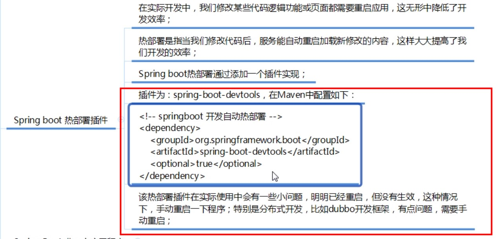

